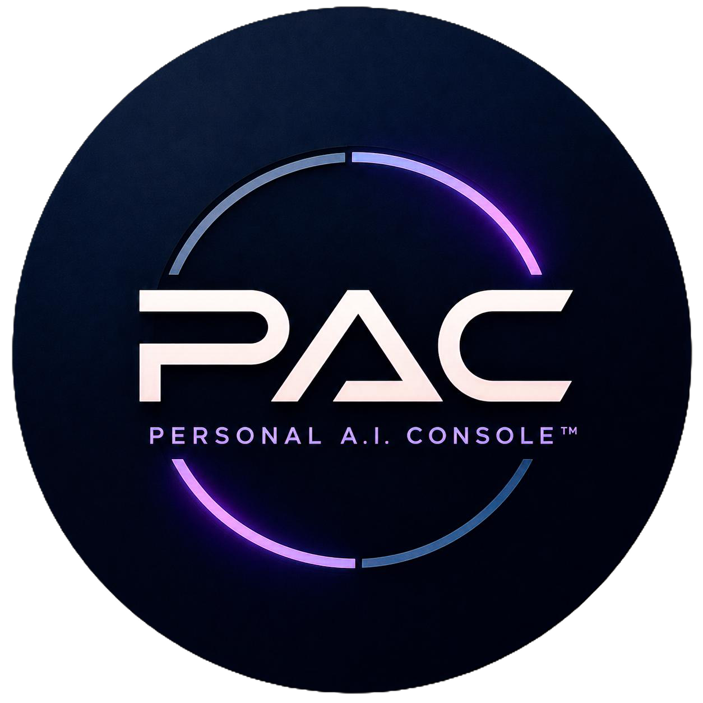
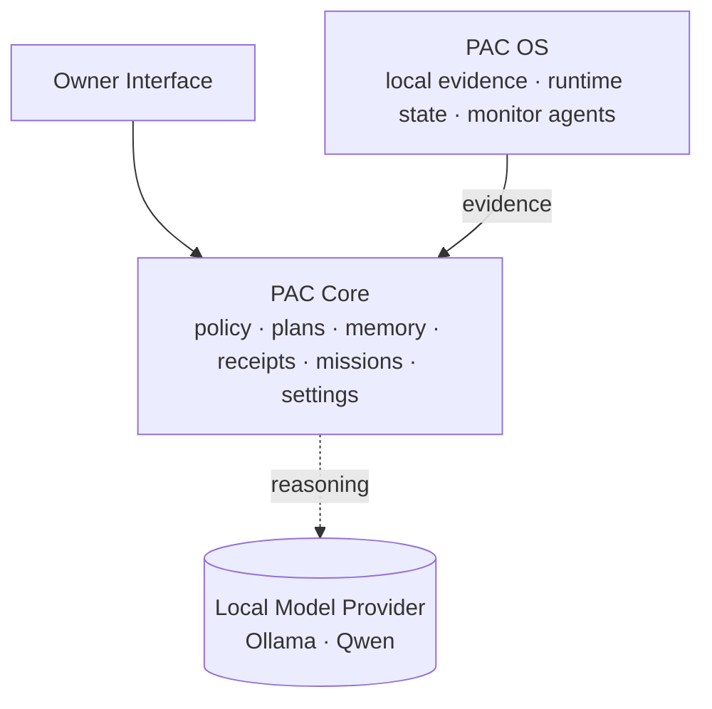
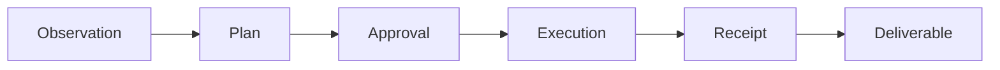

<p align="center">
  
</p>

# Personal A.I. Console&trade;

A local-first command center for governed AI — one owner, one machine, in full command.

> *Status: active private prototype. Working software, not a shipped product. This repository is positioning and architecture &mdash; the implementation stays private until it's ready.*

Plenty of tools now *show* you what an AI is doing. Personal A.I. Console (PAC) is built for the harder half: deciding what your AI is *allowed* to do, and proving what it *did* — all on your own hardware. You don't build *with* PAC; you command *from* it: hand work to a crew that operates under your intent, approve what needs you, see the rest as plain-language watch reports, and keep a receipt for every action. A dashboard reports; PAC commands.

PAC treats the model as one replaceable component. The product is the system around the model: policy that decides what the model is allowed to do, receipts that prove what it did, missions that give work a visible lifecycle, and a local evidence layer that knows what's current and what isn't.

This repository is the public showcase for Personal A.I. Console. The implementation stays private.

## Contents

- [Why This Exists](#why-this-exists)
- [How Personal A.I. Console Is Organized](#how-personal-ai-console-is-organized)
- [The Command Center](#the-command-center)
- [How It Works](#how-it-works)
- [Kora](#kora)
- [What's Built](#whats-built)
- [What's Not Built Yet](#whats-not-built-yet)
- [What This Repository Is and Isn't](#what-this-repository-is-and-isnt)
- [What Makes Personal A.I. Console Different](#what-makes-personal-ai-console-different)
- [Roadmap](#roadmap)
- [Naming](#naming)
- [Contact](#contact)
- [Rights](#rights)

---

## Why This Exists

AI is moving from chat interfaces toward agentic systems &mdash; assistants that can plan, use tools, access context, and complete real work on a user's behalf. OpenAI's ChatGPT Agent, Anthropic's Model Context Protocol, Microsoft's agent platforms, and Apple's on-device AI direction all point at the same shift: AI is becoming part of the operating layer, not just another app sitting on top of one.

That future is arriving whether any one person chose it or not. The default version of it runs in the cloud: someone else owns the assistant, the context, the data, the permissions, and the long-term direction. That is convenient, and for many tasks it will stay useful. But it is a trade &mdash; and most people are making it without deciding to.

Personal A.I. Console is built on one principle: powerful AI should make people more capable without making them less in control.

PAC is the local version of the same future. Same agentic capability &mdash; observing, planning, asking permission, executing, leaving evidence behind &mdash; but on the owner's hardware, under the owner's rules, against models the owner controls. The difference is not access; cloud AI is already cheap and everywhere. The difference is ownership. A tool you rent can have its price, its policy, or its model changed under you. A tool you own, you tend yourself &mdash; and that responsibility is the point, not a cost to apologize for.

AI is not weightless &mdash; real compute, real power, and real access sit behind every agent. PAC does not claim to make that cost smaller or greener. What it changes is whose decision it is: running AI becomes something the owner chooses and owns deliberately, rather than a cost abstracted away until you forget you are paying it.

The project started as a personal AI for a smart home. It evolved into a desktop console because the desktop is where the rules get decided. The smart-home work is on the roadmap; the command center comes first.

PAC is not anti-cloud. PAC is not a model provider. PAC is not a chatbot wrapper. It is a local-first command center for governed AI &mdash; and reaching the outside world is a deliberate mode: explicit, posture-gated, and receipted, not the default assumption.

The position is straightforward: if AI is going to be how computers work, the person in front of the computer should still be the one in command of it.

---

## How Personal A.I. Console Is Organized

The current build, internally called PAC Desktop, runs as three layers:



A local model provider (Ollama, currently running Qwen) sits alongside PAC Core as the reasoning provider. The model handles reasoning. PAC Core handles authority. PAC OS provides evidence.

Personal A.I. Console treats the model as a component, not the product. The system around the model is the product.

Those three layers run *under the hood*. What the owner actually operates is a single surface on top of them — the command center.

---

## The Command Center

PAC is not a framework you wire models into, and not a harness you run jobs through. It is a **command center you operate** — an owner's cockpit for one person's AI.

Everything in PAC is reachable from one local surface, organized as stations of a single command center:

| Station | What you do there |
|---|---|
| **Home** | The situation board &mdash; where things stand, and what happened while you were away. |
| **Kora** | The command deck &mdash; her **Inbox** brings you the calls only you can make (decide, review, recover); her **Operations** stream is the watch report of what the crew handled while you were away. |
| **Chat** | The direct line to the command agent. |
| **Agents** | The crew &mdash; the specialized workers Kora operates, each earning trust on a measured ladder. |
| **Library** | The evidence room &mdash; documents, memory, and the receipts of past work. |
| **Settings** | The controls &mdash; posture, models, authority, and appearance. |

The model reasons. Kora commands within the owner's authority. The owner stays in the commander's seat.

Inside the Kora station, that command discipline is explicit. Routine work the crew handles on its own shows up as a **watch report** in Operations &mdash; *what was done, what it means, and who did it* (Builder prepared the workspace; Records indexed the receipt; PAC Core blocked the unsafe write) &mdash; not a raw event log. Anything that needs your authority is lifted into the **Inbox** as one clear call: approve, review, or recover. Either way, the proof sits one tap away. This is the difference PAC cares about: a dashboard tells you *what happened*; a command deck tells you *what it means, whether you're needed, and where the proof is.* For the command model this borrows from &mdash; mission command, watchstanding, crew discipline &mdash; see [docs/operating-doctrine.md](docs/operating-doctrine.md).

---

## How It Works

Personal A.I. Console is built around one work loop:



Not every chat message becomes a mission. Quick questions stay light. But meaningful work has a visible lifecycle:

- what was requested
- what was proposed
- what required approval
- what executed
- what evidence exists
- what was delivered

Inside that loop, every step that touches the system is classified into one of three tiers. The model never decides its own tier.

| Tier | Behavior |
|---|---|
| **SAFE** | May execute without owner confirmation; still governed |
| **SENSITIVE** | Requires explicit owner confirmation before execution |
| **FORBIDDEN** | Blocked in code |

The system runs under three connectivity postures. Posture changes only *how far Kora may reach outward* — she always works locally:

| Posture | Meaning |
|---|---|
| **Sovereign** | No outbound (default). Kora keeps working locally; web-dependent steps are held and resurface when you open a window. |
| **Limited** | Outbound only to an explicit allowlist of approved sources; background web is denied. |
| **Connected** | Owner-authorized open outbound through the governed broker — minus a blocklist that always wins — standing until you close it. |

Outbound is never the default: the owner opens Limited or Connected deliberately and can close it at any time. A separate internal *Maintenance* state handles system upkeep (e.g., local model updates) and is not a user-facing mode. Degraded network or system conditions are surfaced as operational state, but never become permission to bypass posture rules.

Governed actions, policy decisions, and tool invocations write to audit and receipt surfaces separate from the main database. Where the action spine applies, executed work is captured in `action_receipts`. As far as the system is concerned, an action without a receipt didn't happen.

For the full trust architecture &mdash; owner authority, capability tiers, postures, owner-controlled memory, and oversight &mdash; see [docs/trust-model.md](docs/trust-model.md).

---

## Kora

The command agent that drives Personal A.I. Console is named **Kora**.

Kora is not a model persona. She is the planning and execution engine inside Personal A.I. Console: she reads evidence, drafts plans, requests approval when needed, executes through governed capabilities, and writes receipts for the work she touches.

The model provides reasoning and language. Kora's authority comes from the owner's delegation and the policy layer. Her continuity &mdash; journal, receipts, standing orders, mission history, preferences &mdash; lives in the system around the model, not in the model itself. Swap the model, Kora persists.

---

## What's Built

The current private PAC Desktop build includes the following. These are described at a product level; implementation details remain private.

**Interface** &mdash; the command center the Owner operates.

- Browser-based command center with six stations: Home, Kora, Chat, Agents, Library, and Settings (see [The Command Center](#the-command-center))
- Streaming chat responses
- Per-turn evidence disclosure in chat: when a reply drew on something or did something, the turn says so &mdash; attachments read (with match strength), saved conversations recalled, and any tool actions taken, with their receipts grouped under the disclosure &mdash; and turns that used nothing claim nothing
- Working chat context, disclosed: drag-in file attachments (PDFs and images read locally; scanned pages are OCR'd on-device, never sent anywhere), a visible context meter, and long conversations condensed by a rolling summary with the fold disclosed rather than silently applied
- Thread search and reach-back through full chat history, plus per-reply regenerate and copy
- Inbox attention lifecycle: everything Kora raises tracks *seen* and *done* separately &mdash; a glance doesn't count as handled &mdash; with a one-tap Done and a Later verb that snoozes an item and resurfaces it on schedule; nothing is silently dismissed
- System operational awareness in Settings: workflow impact stated plainly (what's blocked, why, and what would unlock it), active alerts, and a per-source liveness ledger that recomputes every age at render time &mdash; stale evidence is labeled *not current*, never presented as fresh
- Settings organized as seven panels: Personal (appearance, voice, startup), Kora (behavior, memory, learning), Privacy (posture, data handling, kill switch), Models, Storage (retention, backups, export/import), System (runtime, monitors, and health), and Advanced (diagnostics, the editable system prompt, and developer controls)
- Local neural voice synthesis using Kokoro, fully offline

**Core runtime** &mdash; the engine that decides what's allowed and remembers what happened.

- FastAPI-based local backend (PAC Core)
- Local models via Ollama; Qwen3.5 in the current reference build, model choice configurable through Settings
- Governed model lifecycle: plain-English per-model verdicts and a per-machine role recommendation derived from locally measured evaluation; pulling a new model is treated as an egress event (posture-gated, audited, one at a time); any measured model exports as a portable model card
- Kora planning and execution engine
- Plan lifecycle: draft, preview, owner confirmation, execution, and receipt-backed completion
- SAFE / SENSITIVE / FORBIDDEN capability tiers, code-enforced
- Three connectivity postures: Sovereign (local-only default), Limited (allowlist-only outbound), Connected (owner-opened open outbound, blocklist always wins); degraded conditions surface as operational state, never permission
- Graduated autonomy profiles, plus a persistent, fail-closed kill switch that halts all autonomous execution and survives restart
- Action receipt spine, lifecycle-tracked from proposal through verification
- Append-only audit trail (`audit.jsonl`), independent of the main database
- Mission and deliverable data model for report, research, draft, status, and audit work
- Standing intelligence watches: owner-defined watch conditions (thresholds, staleness, status changes, content change) evaluated deterministically on a schedule &mdash; no model in the evaluation loop &mdash; with every run receipted and matches promotable into governed, approval-gated plans
- External URL watches under posture: a watch may target a public web page, but it fetches only while the owner has Connected posture open, routes through the governed network broker, respects robots.txt, and records every skipped or denied fetch as an explicit gap in the result &mdash; never a silent miss
- One intelligence feed of record: watch results and specialist mission reports share a single feed &mdash; reports appear as first-class entries read directly from the mission deliverable (one source of record, no copies), are indexed for local semantic search, and can be promoted into follow-up missions through the same approval gate as everything else
- Owner-controlled memory governance: every record carries provenance and trust metadata (confidence, authority chain); consolidation is surfaced as reviewable proposals (merge / conflict / stale) rather than silent edits; memory is organized into owner-defined spaces; and the full set supports export, import, and versioned rollback. In-chat memory commands (save / recall / forget, behind a default-off flag) route every save and delete through the same approval gates as any sensitive action &mdash; memory writes are never silent
- Editable base system prompt layered over a protected, non-editable grounding floor — versioned, revertible, and receipted on every change, so the model's framing can be tuned but its honesty constraints cannot be edited away
- Resource-memory governor (resource-aware execution; VRAM and RAM thresholds) — a hardware concern distinct from the owner-controlled memory above
- Local document repository and Ollama-based embeddings
- Library workspace for offline documents and system knowledge
- Agent lifecycle management (draft, trial, active, proven)

**System layer (PAC OS)** &mdash; the local evidence and runtime substrate underneath Core.

- Twenty-one registered runtime monitor agents covering health (ops, disk, RAM, CPU, GPU, network), integrity (state-integrity validation, database journaling), lifecycle (process supervisor, heartbeat, session signature), intelligence (knowledge monitor, preference learner, RFI collector, ambient state), and operations (job runner, housekeeping, backup, log aggregator, system identity, alerting)
- Event bus, job system, trace logging with rotation
- Two-surface agent control: a complete Owner-controlled registry of all agents, and a smaller delegable set Kora is allowed to restart. Kora cannot restart agents that observe her own behavior.

**Connectivity** &mdash; how Personal A.I. Console reaches the outside world.

- WAN awareness: deferred plans surface when the network restores
- Network broker module for governed outbound (architecture in place; specific connectors not yet shipped)
- Governed, read-only web research: an off-by-default Research Specialist that performs public-web reads only, allowed solely when outbound is open (Limited or Connected) and SSRF-hardened. Experimental.

**Security** &mdash; defenses in depth around input, secrets, and the filesystem.

- Input firewall: untrusted-content sanitization, invisible-character removal
- Secret scanner: pattern-based redaction
- Filesystem guard: sensitive-path blocking
- Trusted workspace roots
- Rate limiting

---

## What's Not Built Yet

Not everything in Personal A.I. Console is finished. The work loop is most mature through the approval stage &mdash; observation, policy enforcement, planning, and owner approval; execution sandboxing and outcome verification are the areas being hardened next (see the [roadmap](docs/roadmap.md)).

- The public showcase does not include the private implementation code.
- The validated platform is Windows; cross-platform work is incomplete.
- Some UI surfaces are catching up to backend capability.
- Mission deliverable synthesis is partially implemented.
- Unified cross-surface search exists, but the polished "search everything" experience is still evolving.
- An episodic-memory surface was built, then deliberately pulled from the current build pending a redesign; the owner-controlled memory system above is unaffected.
- Read-only governed web research exists but is experimental and off by default; broadening it (source storage, extraction, citations) is ongoing.
- Outbound *action* connectors &mdash; pushing to external services &mdash; are not shipped. The network broker is in place, but governed outbound *writes* to third-party services are still roadmap.
- Remote model providers are direction, not part of the current validated release.
- The system is built for local, owner-controlled deployment. It is not hardened for public internet exposure or multi-user hosting.
- Smart-home and IoT control surfaces are on the roadmap but not present in the current desktop build.

---

## What This Repository Is and Isn't

This repository is the public-facing layer for Personal A.I. Console. It exists to make the project visible while keeping the implementation private.

**It is:** product positioning, architecture summaries, a trust model, a documented threat model and OWASP self-assessment, the engineering practices behind the build, a design philosophy, screenshots, a glossary, roadmap notes, and sanitized examples &mdash; evidence of active, disciplined product direction. It will grow with demo material as the public showcase matures.

**Documentation:**

*Architecture & flow*
- [docs/architecture.md](docs/architecture.md) &mdash; the three-layer architecture (structure)
- [docs/how-it-works.md](docs/how-it-works.md) &mdash; the governed flow: sequence, decision points, autonomy, posture
- [docs/operating-doctrine.md](docs/operating-doctrine.md) &mdash; the command model PAC borrows from: mission command, watchstanding, crew discipline, mapped to the surfaces

*Trust & security*
- [docs/trust-model.md](docs/trust-model.md) &mdash; owner authority, tiers, postures, memory, oversight
- [docs/trust-quartet.md](docs/trust-quartet.md) &mdash; the four invariants, freshness-as-truth, and why a refusal isn't an error
- [docs/agent-governance.md](docs/agent-governance.md) &mdash; how PAC governs the agents Kora operates: packs, the trust ratchet, propose-don't-apply
- [docs/threat-model.md](docs/threat-model.md) &mdash; threats PAC resists and what it explicitly doesn't claim
- [docs/owasp-agentic-mapping.md](docs/owasp-agentic-mapping.md) &mdash; honest self-assessment against the OWASP Agentic AI Top 10
- [docs/aisvs-self-assessment.md](docs/aisvs-self-assessment.md) &mdash; chapter-level scoring against OWASP AISVS 1.0, the verification standard; gaps stated plainly
- [docs/governance-posture.md](docs/governance-posture.md) &mdash; how PAC maps to AI governance frameworks: NIST AI RMF, EU AI Act, OWASP Agentic; written for governance and compliance readers

*How it's built & how it looks*
- [docs/engineering-discipline.md](docs/engineering-discipline.md) &mdash; the practices behind the trust model: tests as enforced invariants, an append-only change ledger, drift detection
- [docs/design-language.md](docs/design-language.md) &mdash; the calm-by-default design philosophy
- [docs/screenshots.md](docs/screenshots.md) &mdash; annotated screenshots from the prototype
- [demos/demo-walkthrough.md](demos/demo-walkthrough.md) &mdash; a governed task end to end, tied to the screenshots

*Reference*
- [docs/roadmap.md](docs/roadmap.md) &mdash; what's built now vs. product direction
- [docs/glossary.md](docs/glossary.md) &mdash; PAC vocabulary
- [examples/](examples/) &mdash; public-safe mock artifacts (mission flow, policy decision, receipt, audit, agent, denial, freshness)

**It is not:** the source-code repository, a clone-and-run distribution, a cloud service, a chatbot wrapper, or a place for secrets, logs, databases, or production configuration.

The private PAC Desktop implementation remains separate.

---

## What Makes Personal A.I. Console Different

Many personal AI tools are front ends for cloud models. Personal A.I. Console is built around the operating layer that sits *between* the model and the work &mdash; the layer where decisions about authority, evidence, and accountability actually live.

It is also not a framework or a developer harness: you do not assemble PAC, you operate it. PAC is the command center; the engineering around it is what makes that command center trustworthy.

The differentiator is the trust architecture:

```text
model reasoning
   + owner authority
   + local evidence
   + policy gates
   + posture
   + memory governance
   + receipts
   + visible missions
```

Governing AI agents &mdash; policy, approvals, audit, least privilege &mdash; is becoming its own category, and that is the right direction. Most of that work targets *fleets of agents in the enterprise cloud*: a governance layer you attach to someone else's frameworks. Personal A.I. Console takes the same problem from the other end. It is the **local-first, single-owner** version &mdash; where the agent, the policy, the evidence, the memory, the posture, and the receipts are one integrated system the owner runs on their own machine. Governance is built into the product, not bolted on around it.

That direction is now explicit in the market. The enterprise world is converging on **governed teams of specialist agents** that act within policy and **surface only the exceptions that need a human** &mdash; Oracle's Fusion Agentic Applications, Microsoft's agent platforms, and others are building exactly that, for the cloud. PAC is the same architecture from the personal end: a crew of scoped specialists, an exception-by-design command surface (decisions to the owner, the rest as watch reports), and receipts throughout &mdash; running on one owner's machine instead of someone else's data center. The convergence is a good sign the shape is right; the difference is who owns it.

PAC also treats autonomy as a dial, not a switch. Instead of "fully locked down" or "fully trusted," it offers graduated profiles &mdash; observe, read-only, bounded routine work, and time-bounded control &mdash; with one guarantee: turning the dial up changes how often PAC asks, never what it is permitted to do. The capability tiers and the policy gate bound every level.

The model is a replaceable component; everything around it &mdash; authority, evidence, audit, memory &mdash; runs on the owner's hardware, end to end. Personal A.I. Console is designed for a future where everyone has an AI assistant, but where the person still owns the machine, the data, the memory, the permission boundary, and the final call.

For how PAC's controls line up against the OWASP Agentic AI Top 10, see [docs/owasp-agentic-mapping.md](docs/owasp-agentic-mapping.md).

---

## Roadmap

The public showcase now includes architecture, a how-it-works process flow, a trust model, screenshots, a demo walkthrough, sanitized examples, a glossary, and a roadmap. A recorded video demo is a future addition.

Product direction includes a stronger mission deliverable loop, governed web research and outbound connectors, richer ambient briefs and search, specialized agent workers, expanded deployment profiles, and the return of the smart-home / IoT control plane.

See **[docs/roadmap.md](docs/roadmap.md)** for the full roadmap &mdash; the earned-autonomy model, what's built now, the product direction, and what's explicitly out of scope.

---

## Naming

**Personal A.I. Console** is the product name.
**PAC** is the abbreviation.
**PAC Desktop** is the current private desktop implementation.

See [TRADEMARK.md](TRADEMARK.md) for trademark notice and permitted use.

---

## Contact

Personal A.I. Console&trade; is an active private prototype. For portfolio review, collaboration, or private demo inquiries, contact **personal.aiconsole@gmail.com**.

Please do not use this repository to request source-code access &mdash; the implementation is private and not available for distribution.

---

## Rights

&copy; 2026 Eric Coomer. All rights reserved.

Personal A.I. Console&trade; is the subject of pending U.S. trademark application Serial No. 99527085 by Eric Coomer. No license is granted to copy, modify, redistribute, sublicense, commercialize, or build derivative works from this project unless permission is explicitly provided in writing.

---

*Company and product names are referenced for context only. Personal A.I. Console is not affiliated with, sponsored by, or endorsed by OpenAI, Anthropic, Microsoft, Apple, Oracle, or any other referenced company.*
