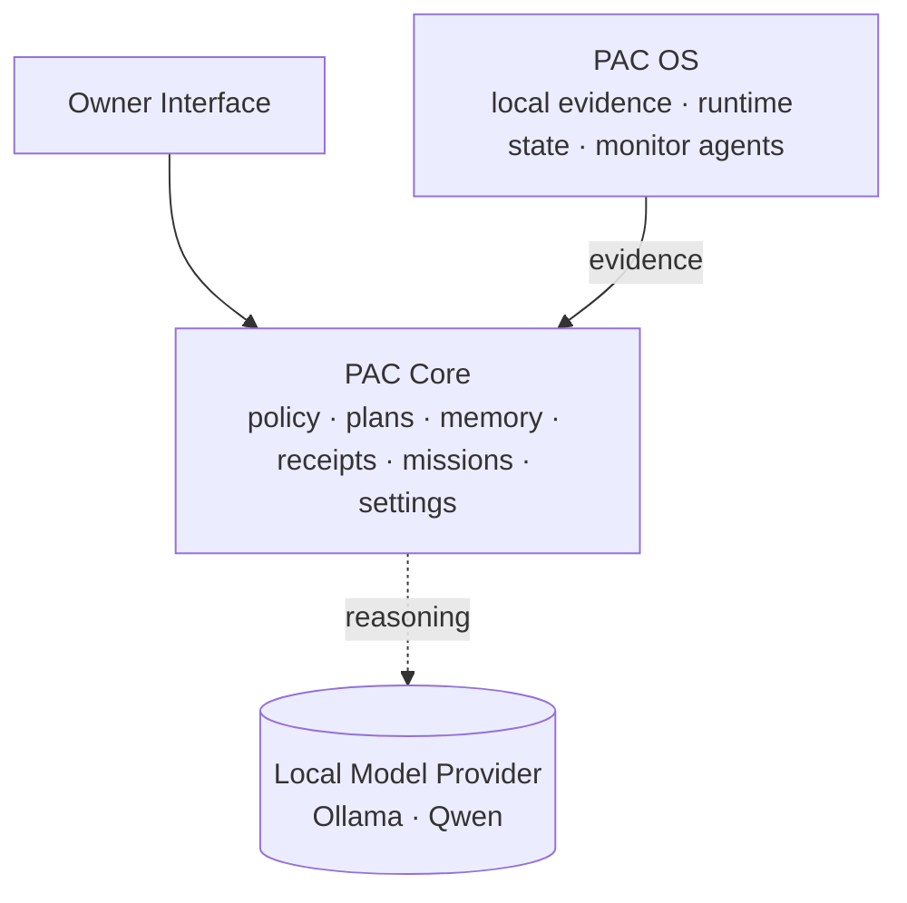
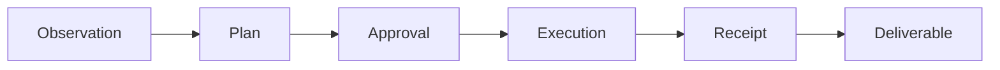

# Personal A.I. Console&trade;

A local-first AI command layer for a single owner.

> *Status: active private prototype. Working software, not a shipped product. This repository is positioning and architecture &mdash; the implementation stays private until it's ready.*

Personal A.I. Console (PAC) treats the model as one replaceable component. The product is the system around the model: policy that decides what the model is allowed to do, receipts that prove what it did, missions that give work a visible lifecycle, and a local evidence layer that knows what's current and what isn't.

This repository is the public showcase for Personal A.I. Console. The implementation stays private.

## Contents

- [Why This Exists](#why-this-exists)
- [How Personal A.I. Console Is Organized](#how-personal-ai-console-is-organized)
- [How It Works](#how-it-works)
- [Kora](#kora)
- [What's Built](#whats-built)
- [What's Not Built Yet](#whats-not-built-yet)
- [What This Repository Is and Isn't](#what-this-repository-is-and-isnt)
- [What Makes Personal A.I. Console Different](#what-makes-personal-ai-console-different)
- [Roadmap](#roadmap)
- [Naming](#naming)
- [Rights](#rights)

---

## Why This Exists

AI is moving from chat interfaces toward agentic systems &mdash; assistants that can plan, use tools, access context, and complete real work on a user's behalf. OpenAI's ChatGPT Agent, Anthropic's Model Context Protocol, Microsoft's agent platforms, and Apple's on-device AI direction all point at the same shift: AI is becoming part of the operating layer, not just another app sitting on top of one.

The default version of that future runs in the cloud. Someone else owns the assistant, the context, the data, and the access. That is convenient. It is also a trade most people are making without thinking about it.

Personal A.I. Console is built on one principle: powerful AI should make people more capable without making them less in control.

Personal A.I. Console is the local version of the same future. Same agentic capability &mdash; observing, planning, asking permission, executing, leaving evidence behind &mdash; but on the owner's hardware, under the owner's rules, against models the owner controls.

The project started as a personal AI for a smart home. It evolved into a desktop console because the desktop is where the rules get decided. The smart-home work is on the roadmap.

The position is straightforward: if AI is going to be how computers work, the person in front of the computer should still be the one in charge of it.

---

## How Personal A.I. Console Is Organized

The current build, internally called PAC Desktop, runs as three layers:



A local model provider (Ollama, currently running Qwen) sits alongside PAC Core as the reasoning provider. The model handles reasoning. PAC Core handles authority. PAC OS provides evidence.

Personal A.I. Console treats the model as a component, not the product. The system around the model is the product.

---

## How It Works

Personal A.I. Console is built around one work loop:



Not every chat message becomes a mission. Quick questions stay light. But meaningful work has a visible lifecycle:

- what was requested
- what was proposed
- what required approval
- what executed
- what evidence exists
- what was delivered

Inside that loop, every step that touches the system is classified into one of three tiers. The model never decides its own tier.

| Tier | Behavior |
|---|---|
| **SAFE** | May execute without owner confirmation; still governed |
| **SENSITIVE** | Requires explicit owner confirmation before execution |
| **FORBIDDEN** | Blocked in code |

The system runs under three formal postures, and posture changes what's allowed:

| Posture | Meaning |
|---|---|
| **Sovereign** | No outbound; local operation only |
| **Connected** | Time-bounded, owner-authorized outbound through governed paths |
| **Maintenance** | Time-bounded maintenance or elevated system work |

Degraded network or system conditions are surfaced as operational state, but they do not become permission to bypass posture rules.

Governed actions, policy decisions, and tool invocations write to audit and receipt surfaces separate from the main database. Where the action spine applies, executed work is captured in `action_receipts`. As far as the system is concerned, an action without a receipt didn't happen.

For the full trust architecture &mdash; owner authority, capability tiers, postures, owner-controlled memory, and oversight &mdash; see [docs/trust-model.md](docs/trust-model.md).

---

## Kora

The command agent that drives Personal A.I. Console is named **Kora**.

Kora is not a model persona. She is the planning and execution engine inside Personal A.I. Console: she reads evidence, drafts plans, requests approval when needed, executes through governed capabilities, and writes receipts for the work she touches.

The model provides reasoning and language. Kora's authority comes from the owner's delegation and the policy layer. Her continuity &mdash; journal, receipts, standing orders, mission history, preferences &mdash; lives in the system around the model, not in the model itself. Swap the model, Kora persists.

---

## What's Built

The current PAC Desktop build includes the following, verified against the working codebase.

**Interface** &mdash; what the Owner sees and touches.

- Browser-based interface with six primary pages: chat, home, agents, library, Kora, settings
- Streaming chat responses
- Settings surfaces across eight sections: general, models, monitors, voice, Kora, security, prompts, and developer controls
- Local neural voice synthesis using Kokoro, fully offline

**Core runtime** &mdash; the engine that decides what's allowed and remembers what happened.

- FastAPI-based local backend (PAC Core)
- Local models via Ollama; Qwen3.5 in the current reference build, model choice configurable through Settings
- Kora planning and execution engine
- Plan lifecycle: draft, preview, owner confirmation, execution, verified receipt
- SAFE / SENSITIVE / FORBIDDEN capability tiers, code-enforced
- Three-posture model: Sovereign, Connected, Maintenance; degraded conditions surface as operational state
- Action receipt spine, lifecycle-tracked from proposal through verification
- Append-only audit trail (`audit.jsonl`), independent of the main database
- Mission and deliverable data model for report, research, draft, status, and audit work
- Memory governor (resource-aware execution; VRAM and RAM thresholds)
- Local document repository, episodic memory, and Ollama-based embeddings
- Library workspace for offline documents and system knowledge
- Agent lifecycle management (draft, trial, active, proven)

**System layer (PAC OS)** &mdash; the local evidence and runtime substrate underneath Core.

- Nineteen registered runtime monitor agents covering health (ops, disk, RAM, CPU, GPU, network), lifecycle (process supervisor, heartbeat, session signature), intelligence (knowledge monitor, preference learner, RFI collector, ambient state), and operations (job runner, housekeeping, backup, log aggregator, system identity, alerting)
- Event bus, job system, trace logging with rotation
- Two-surface agent control: a complete Owner-controlled registry of all agents, and a smaller delegable set Kora is allowed to restart. Kora cannot restart agents that observe her own behavior.

**Connectivity** &mdash; how Personal A.I. Console reaches the outside world.

- WAN awareness: deferred plans surface when the network restores
- Network broker module for governed outbound (architecture in place; specific connectors not yet shipped)

**Security** &mdash; defenses in depth around input, secrets, and the filesystem.

- Input firewall: untrusted-content sanitization, invisible-character removal
- Secret scanner: pattern-based redaction
- Filesystem guard: sensitive-path blocking
- Trusted workspace roots
- Rate limiting

---

## What's Not Built Yet

Not everything in Personal A.I. Console is finished.

- The public showcase does not include the private implementation code.
- The validated platform is Windows; cross-platform work is incomplete.
- Some UI surfaces are catching up to backend capability.
- Mission deliverable synthesis is partially implemented.
- Unified cross-surface search exists, but the polished "search everything" experience is still evolving.
- Outbound governed connectors are architectural &mdash; the broker is in place; specific connectors are not shipped.
- Remote model providers are direction, not part of the current validated release.
- The system is built for local, owner-controlled deployment. It is not hardened for public internet exposure or multi-user hosting.
- Smart-home and IoT control surfaces are on the roadmap but not present in the current desktop build.

---

## What This Repository Is and Isn't

This repository is the public-facing layer for Personal A.I. Console. It exists to make the project visible while keeping the implementation private.

**It is:** product positioning, architecture summaries, a trust model, screenshots, a glossary, roadmap notes, and sanitized examples &mdash; evidence of active product direction. It will grow with demo material as the public showcase matures.

**Documentation:**
- [docs/architecture.md](docs/architecture.md) &mdash; the three-layer architecture and work loop
- [docs/trust-model.md](docs/trust-model.md) &mdash; owner authority, tiers, postures, memory, oversight
- [docs/screenshots.md](docs/screenshots.md) &mdash; annotated screenshots from the prototype
- [docs/roadmap.md](docs/roadmap.md) &mdash; what's built now vs. product direction
- [docs/glossary.md](docs/glossary.md) &mdash; PAC vocabulary
- [examples/](examples/) &mdash; public-safe mock mission flow and receipt

**It is not:** the source-code repository, a clone-and-run distribution, a cloud service, a chatbot wrapper, or a place for secrets, logs, databases, or production configuration.

The private PAC Desktop implementation remains separate.

---

## What Makes Personal A.I. Console Different

Most personal AI tools are front ends for cloud models. Personal A.I. Console is built around the operating layer that sits *between* the model and the work &mdash; the layer where decisions about authority, evidence, and accountability actually live.

The differentiator is the trust architecture:

```text
model reasoning
   + owner authority
   + local evidence
   + policy gates
   + posture
   + memory governance
   + receipts
   + visible missions
```

The broader industry is moving AI closer to the operating layer: agents that can use tools, assistants that connect to private data sources, and on-device models that reduce cloud dependency. Personal A.I. Console takes that same direction from the owner's side &mdash; local-first, inspectable, and governed by the person who owns the machine. The model is a replaceable component; everything around it &mdash; authority, evidence, audit, memory &mdash; runs on the owner's hardware, end to end.

Personal A.I. Console is designed for a future where everyone has an AI assistant, but where the user still owns the machine, the data, the memory, the permission boundary, and the final call.

---

## Roadmap

**Public showcase work:**
- Architecture diagrams
- Redacted screenshots
- Demo walkthrough
- Example mission flow
- Example receipt format
- Security and privacy model summary
- Public roadmap

**Product direction:**
- Stronger mission deliverable loop
- Governed outbound connectors
- Improved local knowledge search
- Richer re-entry and handoff briefs
- Stronger model-routing profiles
- Specialized agent workers (task-specific agents capable of running different models per worker)
- Safer automation primitives
- Smart-home and IoT control-plane return
- Expanded deployment profiles

---

## Naming

**Personal A.I. Console** is the product name.
**PAC** is the abbreviation.
**PAC Desktop** is the current private desktop implementation.

See [TRADEMARK.md](TRADEMARK.md) for trademark notice and permitted use.

---

## Rights

&copy; 2026 Eric Coomer. All rights reserved.

Personal A.I. Console&trade; is the subject of pending U.S. trademark application Serial No. 99527085 by Eric Coomer. No license is granted to copy, modify, redistribute, sublicense, commercialize, or build derivative works from this project unless permission is explicitly provided in writing.
