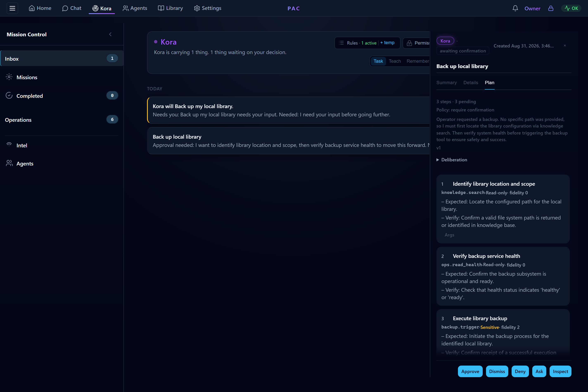
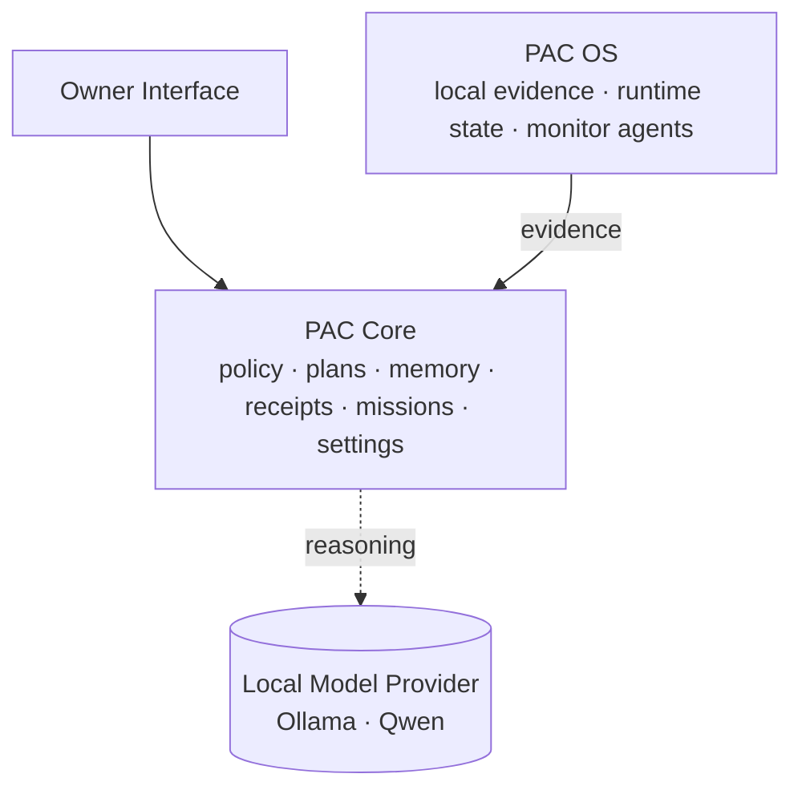
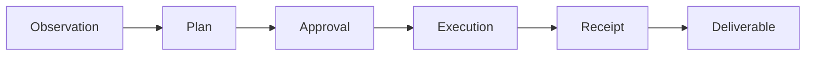

<p align="center">
  
</p>

# Personal A.I. Console&trade;

A local-first command center for governed AI. One owner, one machine, in full command.

> *Status: active private prototype. Working software, not a shipped product. This repository is the public showcase; the implementation stays private.*

Plenty of tools show you what an AI is doing. I built Personal A.I. Console (PAC) for the harder half: deciding what an AI is *allowed* to do, and proving what it *did*, on hardware I own. You hand work to a crew that operates under your intent, approve the calls that need you, read the rest as plain-language watch reports, and keep a receipt for every action. A dashboard reports; PAC commands.

<p align="center">
  
</p>
<p align="center"><i>A plan parked at the approval gate. The model proposed it; nothing runs until the Owner says so. More in <a href="docs/screenshots.md">docs/screenshots.md</a>.</i></p>

PAC treats the model as one replaceable component. The product is the system around the model: policy that decides what the model may do, receipts that prove what it did, missions that give work a visible lifecycle, and a local evidence layer that knows what's current.

## By the numbers

Counts verified against the private build on 2026-07-31. They are descriptive snapshots, not a contract; method in [docs/engineering-discipline.md](docs/engineering-discipline.md).

| Measure | Value |
|---|---|
| Automated tests | 2,278 across 302 test files |
| Contract tests pinning trust invariants | 533 across 94 modules |
| Registered runtime monitor agents | 21 |
| Append-only dev ledger | 125 entries over 5 months, never edited after the fact |
| First live cloud consult | caught a real defect the local model missed, for $0.03 |

## Contents

- [Why This Exists](#why-this-exists)
- [How It's Organized](#how-its-organized)
- [The Command Center](#the-command-center)
- [How It Works](#how-it-works)
- [Kora](#kora)
- [What's Built](#whats-built)
- [What's Not Built Yet](#whats-not-built-yet)
- [What This Repository Is and Isn't](#what-this-repository-is-and-isnt)
- [What Makes It Different](#what-makes-it-different)
- [Roadmap](#roadmap)
- [Naming](#naming), [Contact](#contact), [Rights](#rights)

---

## Why This Exists

PAC started when Clawdbot blew up. I wanted the same thing running local, but inside safeguards. The design borrows from submarine watchstanding: a watchstander operates on defined authority, and nothing consequential happens on one person's say-so. The model stands watch. It doesn't command.

Prompt injection is still unsolved, and the labs building these models say so themselves. Nobody serious is promising injection-proof models anymore; the working consensus is to treat the model as untrusted and design so that doesn't matter. So the question worth building around isn't how to stop a model from being fooled. It's what happens in your system the moment it is fooled. If the answer is "whatever the model decides," that isn't an agent problem. That's an authority problem.

Under this architecture, a fully hijacked model can't act. It can only ask. A successful injection collapses from a catastrophe into a suspicious request that got denied, on the record.

AI is moving from chat interfaces toward agentic systems that plan, use tools, and complete real work on a user's behalf. The default version of that future runs in the cloud, where someone else owns the assistant, the context, the data, and the permissions. That's convenient, and for plenty of tasks it's fine. But it's a trade, and most people are making it without deciding to.

PAC is the local version of the same future: the same agentic capability (observing, planning, asking permission, executing, leaving evidence) on hardware the owner controls. Cloud AI is already cheap and everywhere, so access was never the difference. Ownership is. A tool you rent can have its price, policy, or model changed under you. A tool you own, you tend yourself. That responsibility is the point.

It started as a personal AI for a smart home and turned into a desktop console, because the desktop is where the rules get decided. Reaching the outside world is a deliberate mode here: explicit, posture-gated, and receipted, never the default.

This is a personal project, not a company pitch. If AI is going to be how computers work, the person in front of the computer should still be the one in command of it.

---

## How It's Organized

The current build, internally called PAC Desktop, runs as three layers:


```mermaid
flowchart TD
    Owner["Owner Interface"]
    Core["PAC Core<br/>policy · plans · memory · receipts · missions · settings"]
    OS["PAC OS<br/>local evidence · runtime state · monitor agents"]
    Model[("Local Model Provider<br/>Ollama · Qwen")]

    Owner --> Core
    OS -->|evidence| Core
    Core -.->|reasoning| Model
```

The model handles reasoning. PAC Core handles authority. PAC OS provides evidence. Those three layers run under the hood; what the owner operates is a single surface on top of them.

---

## The Command Center

PAC is a command center you operate, an owner's cockpit for one person's AI, organized as stations:

| Station | What you do there |
|---|---|
| **Home** | The situation board: where things stand, and what happened while you were away. |
| **Kora** | The command deck. Her **Inbox** brings the calls only you can make; her **Operations** stream is the watch report of what the crew handled. |
| **Chat** | The direct line to the command agent. |
| **Agents** | The crew: specialized workers Kora operates, each earning trust on a measured ladder. |
| **Library** | The evidence room: documents, memory, and the receipts of past work. |
| **Settings** | The controls: posture, models, authority, and appearance. |

The model reasons. Kora commands within the owner's authority. The owner stays in the commander's seat.

Routine work the crew handles on its own shows up in Operations as a watch report: what was done, what it means, and who did it. Anything that needs your authority is lifted into the Inbox as one clear call: approve, review, or recover. Either way, the proof sits one tap away. That is the difference PAC cares about: a dashboard tells you what happened; a command deck tells you what it means, whether you're needed, and where the proof is. For the command model this borrows from (mission command, watchstanding, crew discipline) see [docs/operating-doctrine.md](docs/operating-doctrine.md).

---

## How It Works

One work loop:


```mermaid
flowchart LR
    A[Observation] --> B[Plan] --> C[Approval] --> D[Execution] --> E[Receipt] --> F[Deliverable]
```

Quick questions stay light. Meaningful work gets a visible lifecycle: what was requested, what was proposed, what required approval, what executed, what evidence exists, what was delivered.

Every step that touches the system is classified into one of three tiers. The model never holds authority: it proposes; policy disposes. And it never decides its own tier:

| Tier | Behavior |
|---|---|
| **SAFE** | May execute without owner confirmation; still governed |
| **SENSITIVE** | Requires explicit owner confirmation before execution |
| **FORBIDDEN** | Blocked in code |

The system runs under three connectivity postures. Posture changes only how far Kora may reach outward; she always works locally:

| Posture | Meaning |
|---|---|
| **Sovereign** | No outbound (default). Web-dependent steps are held and resurface when you open a window. |
| **Limited** | Outbound only to an explicit allowlist; background web is denied. |
| **Connected** | Owner-opened outbound through the governed broker, minus a blocklist that always wins, standing until you close it. |

Degraded network or system conditions surface as operational state and never become permission to bypass posture rules.

Governed actions write to audit and receipt surfaces separate from the main database. As far as the system is concerned, an action without a receipt didn't happen.

Full trust architecture: [docs/trust-model.md](docs/trust-model.md).

---

## Kora

The command agent that drives PAC is named **Kora**. She is the planning and execution engine: she reads evidence, drafts plans, requests approval when needed, executes through governed capabilities, and writes receipts for the work she touches.

The model provides reasoning and language. Kora's authority comes from the owner's delegation and the policy layer. Her continuity (journal, receipts, standing orders, mission history, preferences) lives in the system around the model. Swap the model, Kora persists.

---

## What's Built

Everything below runs in the current private build. Product level only; implementation details stay private.

**Interface**

- Six-station command center: Home, Kora, Chat, Agents, Library, Settings
- Streaming chat with per-turn evidence disclosure: each reply lists what it read, recalled, and did, receipts attached; turns that used nothing claim nothing
- Drag-in attachments read locally (PDFs and images, on-device OCR), a visible context meter, and disclosed conversation folding
- Thread search across full chat history; per-reply regenerate and copy
- Hand work to a named specialist straight from chat; an ambiguous name fails closed, and the same approval gate is raised as anywhere else
- Inbox lifecycle that tracks *seen* and *done* separately, with Done and Later verbs; nothing is silently dismissed
- Kora's filterable working journal, with on-demand reflection in her own voice
- Operational awareness in Settings: what's blocked, why, and what would unlock it; per-source liveness that labels stale evidence *not current*; one-click diagnostic bundle
- Seven Settings panels: Personal, Kora, Privacy, Models, Storage, System, Advanced
- Voice both directions, fully offline: local neural synthesis (Kokoro), local dictation, and a full voice-conversation mode — start a voice thread, speak, Kora answers aloud, interrupt her mid-reply; nothing spoken or heard leaves the machine

**Core runtime**

- FastAPI local backend; models via Ollama (Qwen in the reference build), configurable in Settings
- Governed model lifecycle: plain-English verdicts from locally measured evaluation, a per-machine role recommendation, model pulls treated as posture-gated egress, portable model cards
- Plan lifecycle from draft through preview, confirmation, execution, and receipt-backed completion
- Approvals that cannot be replayed: an approval opens its door exactly once; re-approving finished work returns the recorded receipt, and unapproved work refuses to run
- SAFE / SENSITIVE / FORBIDDEN capability tiers, enforced in code
- Three postures plus a one-touch panic control that drops everything back to Sovereign instantly
- Graduated autonomy profiles, and a fail-closed kill switch that halts autonomous execution and survives restart
- Action receipt spine, lifecycle-tracked from proposal through verification
- Append-only audit trail (`audit.jsonl`), independent of the main database
- Owner-authored standing orders: scoped, prioritized, and expirable, so a temporary order lapses instead of quietly becoming permanent
- Watch-turnover brief on return: after a deep-idle gap, Kora hands over the watch in a few sentences, with optional voice playback (off by default)
- On-demand after-action briefs over any time window, gathered through governed read-only steps scoped by the system, filed as receipted report deliverables
- Standing intelligence watches evaluated deterministically on a schedule, with no model in the evaluation loop; every run receipted; matches promotable into approval-gated plans
- External URL watches under posture: fetches only while Connected is open, through the broker, honoring robots.txt; every denied fetch is recorded as an explicit gap
- One intelligence feed of record: watch results and specialist reports in a single feed, read from the source deliverable, semantically searchable, every entry taking owner feedback
- Owner-controlled memory: provenance and trust metadata on every record, consolidation as reviewable proposals rather than silent edits, owner-defined spaces, export, import, and versioned rollback; in-chat memory commands gated like any sensitive action
- Editable base system prompt over a protected grounding floor: framing can be tuned, honesty constraints cannot be edited away; every change versioned and receipted
- A specialist crew of a dozen scoped workers on least-privilege capability packs, with a measured lifecycle (draft, trial, active, proven), a create-a-specialist wizard, and per-agent dossiers
- A governed build workspace for the Builder specialist: sandboxed patch-and-test cycles, path-confined, no version-control access; failing tests report red honestly, and a failed build files a failure report with the evidence

**System layer (PAC OS)**

- 21 registered runtime monitor agents across health, integrity, lifecycle, intelligence, and operations
- Event bus, job system, trace logging with rotation
- Two-surface agent control: the Owner controls the full registry; Kora may restart only a smaller delegable set, and never the agents that observe her own behavior

**Connectivity**

- Network broker for governed outbound; WAN awareness resurfaces deferred plans when the network restores
- A governed cloud lane, hired brains: the owner can hire a frontier cloud model (Anthropic today) as the composition brain of a specific specialist; the key is held locally and never echoed or logged; the brain is pinned when a mission starts, and every cloud-composed deliverable carries its provenance
- The cloud stops at the artifact boundary: a hired brain composes deliverables and gives second opinions; it never drafts plans, never executes, never holds a capability
- Egress accountability on every call: SHA-256 fingerprint of exactly what left, byte count, token counts, and cost; under Sovereign the call is killed before the network is touched, and the refusal receipt still records what *would have* left
- Cloud consult, priced in cents: in the first live accounting, a hired reviewer caught a real defect the local model had missed, for three cents
- Environment-isolated cloud client: ambient proxies can never become an undisclosed second party, redirects are refused, a modern TLS floor is enforced
- Governed read-only web research: off by default, allowed only when outbound is open, SSRF-hardened; experimental

**Security**

- Input firewall (untrusted-content sanitization, invisible-character removal), secret scanner, filesystem guard, trusted workspace roots, rate limiting, and a rotatable single-owner access key

---

## What's Not Built Yet

The work loop is most mature through the approval stage. The first governed execution sandbox is live, and outcome verification is the area being hardened next (see the [roadmap](docs/roadmap.md)).

- The public showcase does not include the private implementation code.
- The validated platform is Windows; cross-platform work is incomplete.
- Some UI surfaces are catching up to backend capability.
- Deliverable synthesis is strongest for report-style work; long-form document drafting is still maturing.
- Unified cross-surface search exists, but the polished "search everything" experience is still evolving.
- An episodic-memory surface was built, then deliberately pulled pending a redesign; owner-controlled memory is unaffected.
- Read-only web research is experimental and off by default; source storage, extraction, and citations are ongoing.
- Outbound *action* connectors (governed writes to third-party services) are not shipped; the broker is in place.
- Remote model use is deliberately narrow: one provider today, artifact boundary only. A broader roster is direction; cloud models planning, executing, or holding capability is a boundary that stays, not a gap.
- Built for local, owner-controlled deployment; not hardened for public internet exposure or multi-user hosting.
- Smart-home and IoT control are on the roadmap, not in the current build.

---

## What This Repository Is and Isn't

This repository makes the project visible while keeping the implementation private.

**It is:** architecture, a trust model, a threat model, OWASP self-assessments, the engineering practices behind the build, screenshots, a demo walkthrough, sanitized examples, a glossary, and a roadmap.

**Documentation:**

*Architecture & flow*
- [docs/architecture.md](docs/architecture.md): the three-layer architecture
- [docs/how-it-works.md](docs/how-it-works.md): the governed flow, decision points, autonomy, posture
- [docs/operating-doctrine.md](docs/operating-doctrine.md): the command model, mapped to the surfaces

*Trust & security*
- [docs/trust-model.md](docs/trust-model.md): owner authority, tiers, postures, memory, oversight
- [docs/trust-quartet.md](docs/trust-quartet.md): the four invariants, freshness as truth, why a refusal isn't an error
- [docs/agent-governance.md](docs/agent-governance.md): packs, the trust ratchet, propose-don't-apply
- [docs/threat-model.md](docs/threat-model.md): threats PAC resists and what it explicitly doesn't claim
- [docs/owasp-agentic-mapping.md](docs/owasp-agentic-mapping.md): self-assessment against the OWASP Agentic AI Top 10
- [docs/aisvs-self-assessment.md](docs/aisvs-self-assessment.md): chapter-level scoring against OWASP AISVS 1.0, gaps stated plainly
- [docs/governance-posture.md](docs/governance-posture.md): NIST AI RMF, EU AI Act, and OWASP mappings for governance readers

*How it's built & how it looks*
- [docs/engineering-discipline.md](docs/engineering-discipline.md): tests as enforced invariants, the append-only ledger, drift detection
- [docs/design-language.md](docs/design-language.md): the calm-by-default design philosophy
- [docs/screenshots.md](docs/screenshots.md): annotated screenshots from the prototype
- [demos/demo-walkthrough.md](demos/demo-walkthrough.md): a governed task end to end, tied to the screenshots

*Reference*
- [docs/roadmap.md](docs/roadmap.md): what's built now vs. product direction
- [docs/glossary.md](docs/glossary.md): PAC vocabulary
- [examples/](examples/): public-safe mock artifacts (mission flow, policy decision, receipt, audit, agent, denial, freshness)

**It is not:** the source-code repository, a clone-and-run distribution, a cloud service, or a place for secrets, logs, databases, or production configuration.

---

## What Makes It Different

Most personal AI tools are front ends for cloud models. PAC is built around the operating layer between the model and the work, where decisions about authority, evidence, and accountability actually live. It isn't a framework you assemble. You operate it.

The trust architecture is the differentiator:

```text
model reasoning
   + owner authority
   + local evidence
   + policy gates
   + posture
   + memory governance
   + receipts
   + visible missions
```

Agent governance (policy, approvals, audit, least privilege) is becoming its own category, and nearly all of it targets fleets of agents in the enterprise cloud. PAC takes the same problem from the other end: the local-first, single-owner version, where the agent, the policy, the evidence, and the receipts are one integrated system on the owner's machine. The enterprise convergence on governed specialist crews with exception-based human oversight is a good sign the shape is right. The difference is who owns it.

Autonomy is a dial here, with graduated profiles from observe up to time-bounded control, and one guarantee: turning the dial up changes how often PAC asks, never what it is permitted to do.

---

## Roadmap

Product direction: a stronger mission deliverable loop, governed web research and outbound connectors, richer ambient briefs and search, specialized agent workers, expanded deployment profiles, and the return of the smart-home / IoT control plane.

See **[docs/roadmap.md](docs/roadmap.md)** for the earned-autonomy model, what's built now, and what's explicitly out of scope.

---

## Naming

**Personal A.I. Console** is the product name. **PAC** is the abbreviation. **PAC Desktop** is the current private desktop implementation. See [TRADEMARK.md](TRADEMARK.md).

## Contact

PAC is built and run by one person, which is kind of the point. For portfolio review, collaboration, or private demo inquiries: **personal.aiconsole@gmail.com**.

Please do not use this repository to request source-code access; the implementation is private and not available for distribution.

## Rights

&copy; 2026 Eric Coomer. All rights reserved. See [LICENSE](LICENSE).

Personal A.I. Console&trade; is the subject of pending U.S. trademark application Serial No. 99527085 by Eric Coomer. No license is granted to copy, modify, redistribute, sublicense, commercialize, or build derivative works from this project unless permission is explicitly provided in writing.

*Company and product names are referenced for context only. Personal A.I. Console is not affiliated with, sponsored by, or endorsed by any referenced company.*
