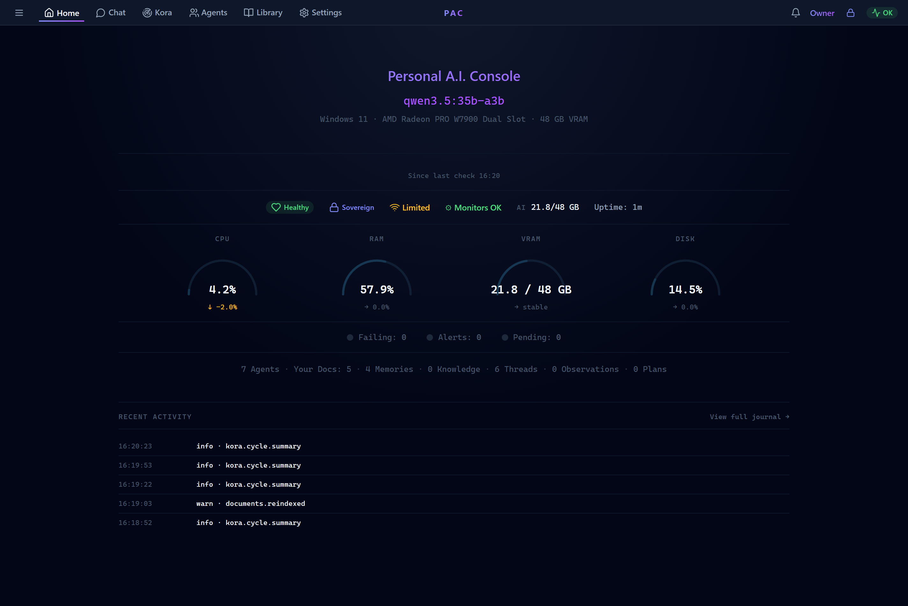
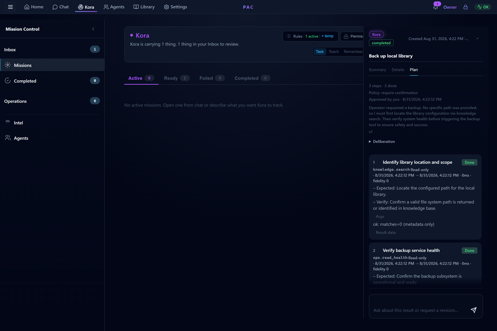
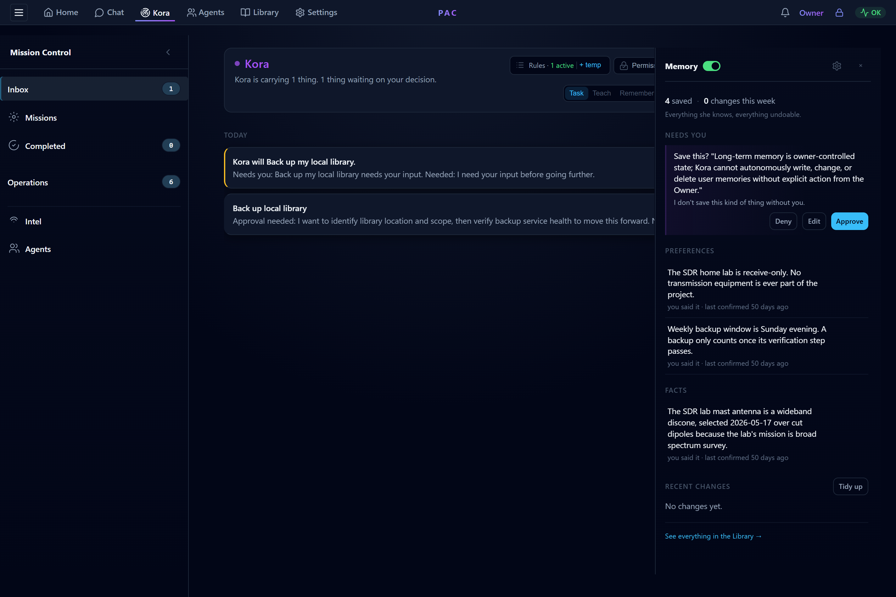
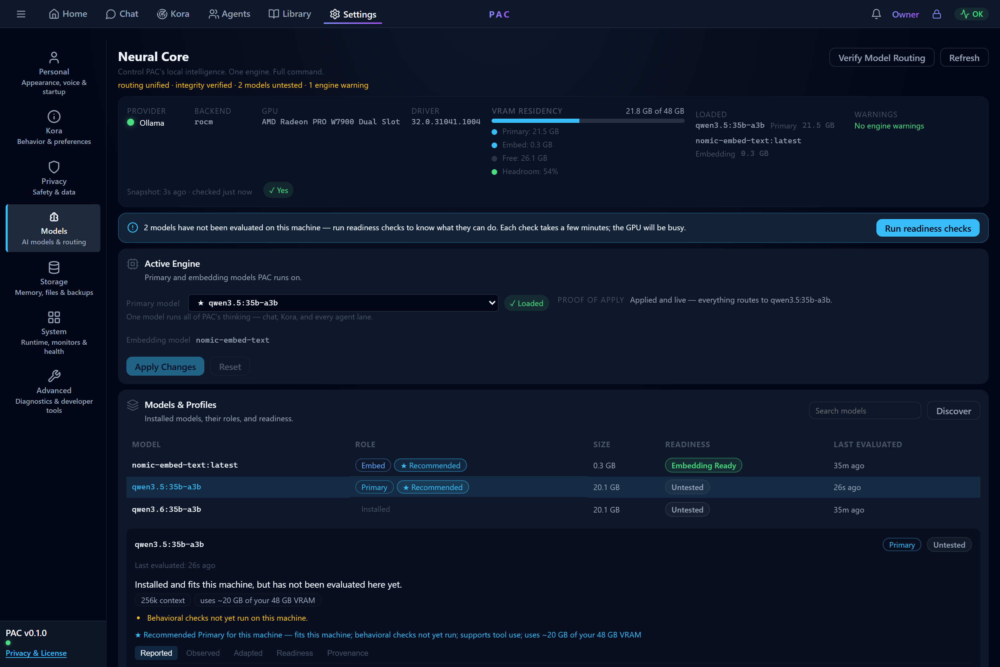

# Demo Walkthrough

This walks through a single governed task in Personal A.I. Console&trade; (PAC), end to end, using the screenshots in [`../assets/screenshots/`](../assets/screenshots/). It is captured from the current private prototype with demo data: the owner is shown simply as **Owner**, and nothing here exposes private implementation, paths, or personal data.

The point of the walkthrough is to show *how PAC behaves*, not just what it looks like: a request becomes a plan, the plan is classified and gated, sensitive work waits for the owner, and the result leaves a receipt.

**Scenario:** the Owner asks Kora to *back up the local library*.

---

## 1. The system the work runs on

Before any work happens, PAC presents its own state: the active local model, the current **posture** (Sovereign) beside an honest chip reporting observed network reachability, overall health, and local resource use, all on the owner's hardware. The posture is a stance the owner chose; the network chip is a condition the system measured. PAC keeps those distinct, and a degraded condition never loosens the stance. This is the command surface the rest of the flow happens under. Nothing here depends on a cloud service.

---

## 2. Kora drafts a plan and stops for approval

The Owner's request becomes a **plan**, not an immediate action. Kora drafts the steps and presents them in the inspector rail *before* anything runs, each carrying the tier the capability registry assigned it:

1. Identify library location and scope (**Read-only**)
2. Verify backup service health (**Read-only**)
3. Execute library backup (**Sensitive**)

Each step names the capability it will call, what it should produce, and how the result will be verified, declared up front, before anything runs.

Two things are happening underneath this screen:

- Each step's **tier** comes from PAC's capability registry, not from the model. The model proposes work; it does not get to declare its own work "safe."
- A deterministic policy evaluation runs over the plan. Because step 3 is **Sensitive**, the plan's outcome is *requires confirmation*, so the plan pauses as *awaiting confirmation*, and the queue card carries the one verb that can move it: **Approve**. The read-only checks could run on their own; the consequential step cannot.

This is the heart of PAC: the owner sees what was requested, what is proposed, and exactly what will need their say-so &mdash; before it happens.

---

## 3. After approval: execution leaves a receipt

Once the Owner approves, the steps execute and the same rail follows the plan to its completed state: the chip flips to **completed**, the header reads **3 steps &middot; 3 done**, and the approval itself is part of the record: *Approved by you*, timestamped to the second. Each step now carries its receipt inline: start and finish times, duration, the result it returned, and its raw result data one click away. A composer below invites the Owner to ask about the result or request a revision, because a completed plan is a conversation piece, not a dead file. The rail stops short of declaring victory: the *proof* lives in this receipt chain, which is exactly where the specialist mission in [screenshots.md](../docs/screenshots.md) goes to verify this same backup before calling the restore point *provable*.

As far as PAC is concerned, an action without a receipt didn't happen. The completed view is the receipt: what was planned, what was approved, what ran, and the verification behind it.

---

## 4. Memory stays the owner's

Throughout, what Kora remembers stays governed. Routine observations from conversation are captured silently (each write leaves a receipt and reverts in one click from her memory card), while anything sensitive, or anything that contradicts what the Owner has said, is proposed and waits for approval. Content from documents, the web, or tools can never seed personal memory; only the Owner's own words can. Nothing is remembered, edited, or forgotten off the record.

---

## 5. The model is a replaceable part

The reasoning above came from a local model (Ollama, running Qwen in the reference build), managed in the **Neural Core**. The view shows the engine as it actually is (what's loaded, where the VRAM went, and a proof-of-apply line confirming everything routes to the selected model) and treats every installed model as unproven until readiness checks run on this machine. Swap the model, and everything that made the flow trustworthy (the tiers, the approval gate, the receipt, the posture) persists, because none of it lives in the model.

---

## What this flow demonstrates

| Guarantee | Where it showed up |
|---|---|
| The model doesn't set its own permissions | Tiers come from the registry (step 2) |
| Sensitive work needs explicit owner approval | The plan paused on the SENSITIVE step (step 2) |
| Consequential work leaves evidence | The verified receipt (step 3) |
| Memory is owner-governed | Silent captures carry receipts and revert; sensitive saves ask (step 4) |
| The model is a component, not the authority | Configurable provider (step 5) |
| Local-first by default | Sovereign posture on the owner's hardware (step 1) |

The capability tiers, autonomy levels, and policy behavior shown here are described further in [how-it-works.md](../docs/how-it-works.md) and [trust-model.md](../docs/trust-model.md). For the shapes of the artifacts a flow like this produces, see [`../examples/`](../examples/).

*This walkthrough uses demo data and describes product behavior. It is not an implementation guide.*
