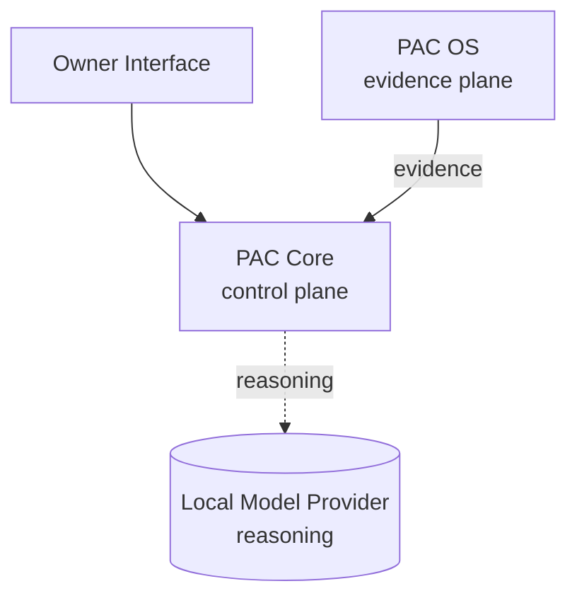
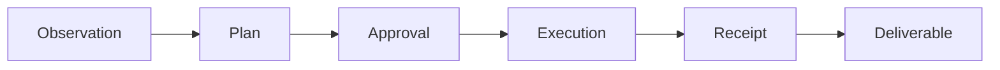

# Architecture

Personal A.I. Console (PAC) is organized as three architectural layers, with the model treated as a swappable reasoning component:

This document covers the architecture at a product level. It is not an implementation guide and does not include source code, schemas, or production configuration. For product positioning and what is currently built, see the [README](../README.md).

---

## Layers

### Owner Interface

The command center the Owner operates &mdash; browser-based, served locally. It is organized as six stations (Home, Kora, Chat, Agents, Library, Settings); see [The Command Center](../README.md#the-command-center) for what each one is for.

The Owner Interface is intentionally thin. It presents state, accepts Owner input, and sends requests to PAC Core. It does not enforce policy, hold authority, or own system state. Authority decisions happen in PAC Core.

### PAC Core

The control plane. PAC Core holds the policy gate, capability registry, plan and mission lifecycle, the action receipt spine, the memory governor, and the audit trail. Capability-backed work flows through Core's policy decision before it can execute.

Core also hosts **Kora** &mdash; the planning and execution engine that drafts plans, requests approval, executes through governed capabilities, and writes receipts.

### PAC OS

The evidence plane. PAC OS observes machine state and writes structured evidence into local storage that Core can read. PAC OS runs as a separate runtime with its own agent scheduler.

PAC OS does not make policy decisions and is not the Owner-facing authority surface. It can perform bounded runtime jobs under its own contracts, but its primary job is to **observe and report**, not to **decide**.

### Local Model Provider

The reasoning component. The current reference build uses Ollama with Qwen, with model choice configurable through Settings. The provider is treated as a replaceable component that Core calls when reasoning is needed.

The model is not the product. The system around the model is the product.

---

## Authority Model

Personal A.I. Console enforces authority through three mechanisms.

### Capability tiers

Every step that touches the system is classified into one of three tiers, code-enforced:

| Tier | Behavior |
|---|---|
| **SAFE** | May execute without owner confirmation; still governed |
| **SENSITIVE** | Requires explicit owner confirmation before execution |
| **FORBIDDEN** | Blocked in code |

The model never decides its own tier. Tier assignment lives in Core's capability registry.

### Postures

The system runs under three connectivity postures. Posture changes only how far Kora may reach outward — she always works locally:

| Posture | Meaning |
|---|---|
| **Sovereign** | No outbound (default); local operation only. Web-dependent steps are held and resurface when a window opens |
| **Limited** | Outbound only to an explicit allowlist of approved sources; background web denied |
| **Connected** | Owner-opened open outbound through the governed broker, minus a blocklist that always wins; standing until closed |

Outbound is never the default; the owner opens Limited or Connected deliberately. A separate internal *Maintenance* state handles system upkeep and is not a user-facing mode. Degraded network or system conditions are surfaced as operational state, but they do not become permission to bypass posture rules.

### Owner authority boundary

There is one Owner per system. The Owner grants authority, approves SENSITIVE actions, and decides what the system is allowed to do. Kora plans and executes within the authority the Owner has granted. PAC enforces the difference in code, not in convention.

---

## Evidence Model

Personal A.I. Console treats the absence of a receipt as the absence of an action.

- **Audit trail.** Governed actions, policy decisions, and tool invocations write to an append-only audit trail (`audit.jsonl`), separate from the main database.
- **Action receipt spine.** Executed work is captured in receipts that are lifecycle-tracked from proposal through verification.
- **Runtime evidence.** PAC OS writes structured observations (monitor agent state, ambient state, traces) that Core can read when reasoning about what is currently true on the machine.

Read paths do not generally produce receipts. Receipts cover work that affects the system or produces deliverables.

---

## The Work Loop

PAC organizes meaningful work into a six-phase lifecycle:

| Phase | Description |
|---|---|
| **Observation** | The system reads available evidence (machine state, memory, prior receipts, documents). |
| **Plan** | Kora drafts a sequence of steps, each tagged with a capability tier. |
| **Approval** | SAFE steps may proceed. SENSITIVE steps require Owner confirmation. FORBIDDEN steps are blocked. |
| **Execution** | Approved steps run through governed capabilities. |
| **Receipt** | Each step's outcome is captured in the receipt spine. |
| **Deliverable** | The completed mission produces a typed output (report, research, draft, status, audit). |

Not every chat message becomes a mission. Lightweight queries stay light. The lifecycle applies to work that needs to be visible and accountable.

---

## Two-Surface Agent Control

PAC OS runs a registry of runtime monitor agents. The agent control surface is intentionally split:

- **Owner control surface** &mdash; the full registry of agents the Owner can see, restart, disable, or retune through Owner-facing controls.
- **Operator-delegable surface** &mdash; a smaller subset of agents Kora may target through governed, policy-checked capabilities.

Kora cannot restart agents that observe her own behavior, evaluate her learning, or alert on her actions. This split is enforced in code so that delegated authority cannot expand to cover the agents that watch the delegate.

---

## Public / Private Boundary

This repository contains the *product architecture* of Personal A.I. Console.

It does not contain:

- Source code or implementation
- Database schemas or migrations
- Production configuration
- Runtime paths or filesystem layouts
- Internal API surfaces
- Security implementation details
- Operational data or logs
- Private design documents

The private implementation remains under separate ownership and control. See [NOTICE.md](../NOTICE.md) for rights and licensing terms.

---

## Anti-Claims

To prevent misreading, this is what the document above is **not** claiming:

- Not claiming the system is hardened for public internet exposure.
- Not claiming cross-platform validation (current validated platform is Windows).
- Not claiming a finished mission deliverable loop.
- Not claiming shipped outbound connectors (the network broker exists; specific connectors are roadmap).
- Not claiming any specific third-party integration or compliance certification.

For the full list of what is built versus in progress, see the README.
