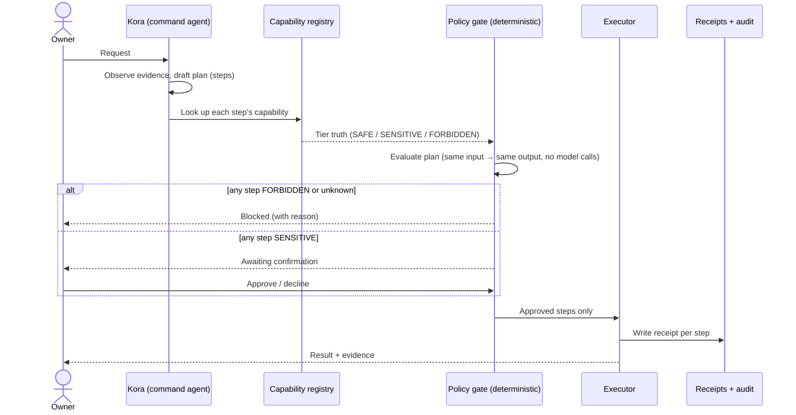

# How It Works

This document describes the *process* by which Personal A.I. Console&trade; (PAC) turns a request into governed work &mdash; the sequence, the decision points, and the guarantees at each one. [architecture.md](architecture.md) covers the *structure* (the layers); this covers the *flow* through them.

It is a behavior-level description. It is not an implementation guide and does not include source, real schemas, or the internal logic itself. For the principles behind it see [trust-model.md](trust-model.md); for a screenshot walkthrough see [demos/demo-walkthrough.md](../demos/demo-walkthrough.md).

---

## The governed flow

Every consequential request moves through the same sequence. The model proposes; the system decides; the owner authorizes anything sensitive; the result is recorded.

---

## The decision points

### 1. Tiers come from the registry, not the model

Each step names a capability. The capability's **tier** &mdash; SAFE, SENSITIVE, or FORBIDDEN &mdash; is fixed in PAC's capability registry, which is the source of truth. A plan cannot lie about a step's tier; the registry's classification overrides whatever the plan proposed. The model can suggest *what* to do, but not *how dangerous it is allowed to call that*.

### 2. The policy gate is deterministic

Before anything runs, the plan is evaluated by a policy gate with three properties:

- **Deterministic** &mdash; the same plan produces the same decision every time.
- **Registry-truthful** &mdash; it judges against the registry's tiers, not the plan's claims.
- **Model-free** &mdash; it makes no model calls. No prompt, jailbreak, or clever wording changes the outcome.

The outcomes are simple:

| Step classification | Outcome |
|---|---|
| **SAFE** (known, low-risk) | May proceed |
| **SENSITIVE** | Requires explicit owner confirmation |
| **FORBIDDEN** | Blocked |
| **Unknown** capability | Blocked |

A FORBIDDEN or unknown capability stops the plan with a reason. A SENSITIVE step parks the plan until the owner approves. SAFE steps flow.

### 3. The approval gate

When a plan contains sensitive work, it pauses in an *awaiting confirmation* state and surfaces to the owner with what was requested, what's proposed, and what specifically needs a decision. The owner approves, declines, or adjusts. Sensitive work does not execute on the model's say-so.

### 4. Execution is scoped, and every step is recorded

Approved steps run through governed capabilities. Each step's outcome is captured in a **receipt**, lifecycle-tracked from proposal through verification, and governed actions also write to an **append-only audit trail** kept separate from the main data. Read-only work generally doesn't produce receipts &mdash; receipts exist to make *consequential* work inspectable after the fact.

---

## Autonomy: how much runs without asking

PAC separates *how much an agent acts on its own* from *what it is allowed to touch*. These are two different dials, and the second one is never relaxed by the first.

**Per-agent autonomy level** &mdash; set on each agent:

| Level | Behavior |
|---|---|
| `auto` | Acts without per-task confirmation |
| `confirm_summary` | Acts after the owner approves a plan summary (default) |
| `confirm_per_step` | Asks before each step |
| `block` | May observe and propose, but not execute |

**Global autonomy profile** &mdash; a system-wide stance for unattended work, classified into action buckets (A: read-only, B: bounded hygiene, C: control, D: destructive):

| Profile | Auto-executes |
|---|---|
| `monitor_only` | Nothing |
| `readonly` | Bucket A (read-only) |
| `readonly_hygiene` | Buckets A + B (default) |
| `maintenance_window` | Buckets A + B + C, during a planned window |

Destructive (Bucket D) work is never auto-executed under any profile. A **kill switch** can halt all auto-execution immediately.

**The guarantee that ties it together:** autonomy level changes how often PAC pauses to confirm &mdash; it does **not** change what is permitted. Even an `auto` agent under `maintenance_window` is still bound by the policy gate: FORBIDDEN stays blocked, SENSITIVE tiers stay governed, and nothing escapes the registry's truth. The leash length is adjustable; the fence is not.

---

## Posture: reaching outside the machine

Outbound access is governed by a system-wide **posture**, not by individual steps:

| Posture | Outbound |
|---|---|
| **Sovereign** | None &mdash; local operation only (default) |
| **Connected** | Time-bounded, owner-authorized, through a governed broker |
| **Maintenance** | Time-bounded maintenance / elevated work |

In Sovereign posture, outbound capabilities are blocked outright, regardless of tier or autonomy. Degraded network or system conditions are surfaced as operational state &mdash; they never become permission to bypass posture rules. The system fails toward caution.

---

## Summary of guarantees

- The model proposes; it never sets its own permissions.
- Tiers are registry truth; a plan can't reclassify itself.
- The gate is deterministic and model-free; wording can't change a decision.
- Sensitive work waits for the owner; forbidden work is blocked.
- Autonomy controls confirmation frequency, never permission.
- Outbound is posture-gated; Sovereign means local-only.
- Consequential work leaves a receipt and an audit entry.

---

*This describes how PAC behaves. It is not a specification for re-implementation and does not represent the actual schemas, interfaces, or internal logic of the private build (see [NOTICE.md](../NOTICE.md)). For the artifact shapes a flow produces, see [`../examples/`](../examples/).*
