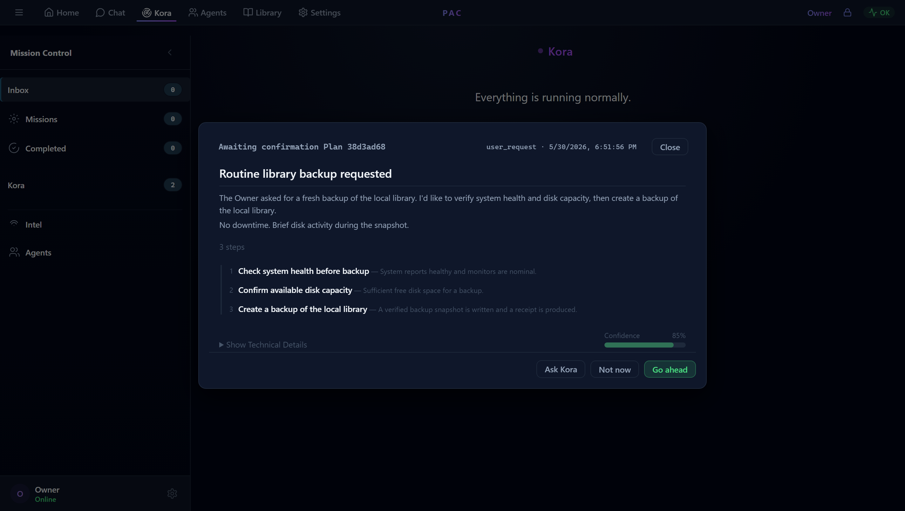
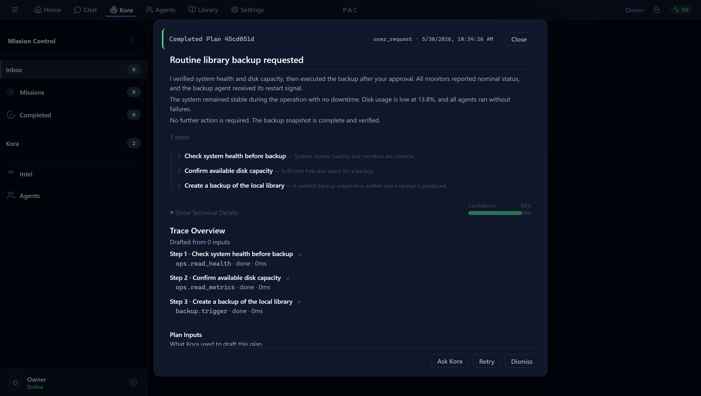
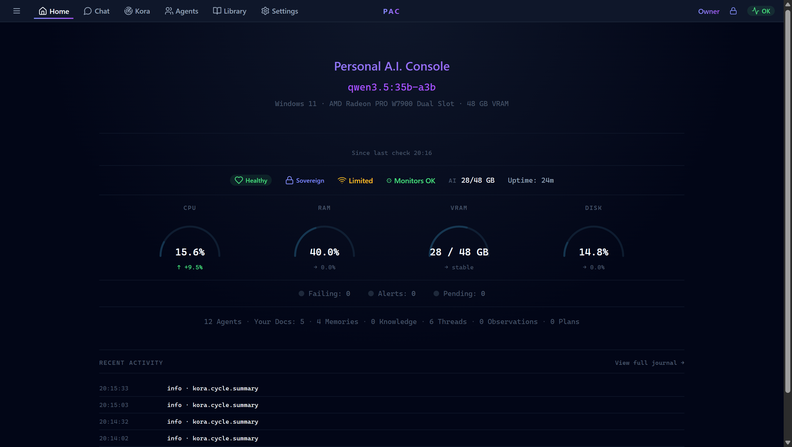
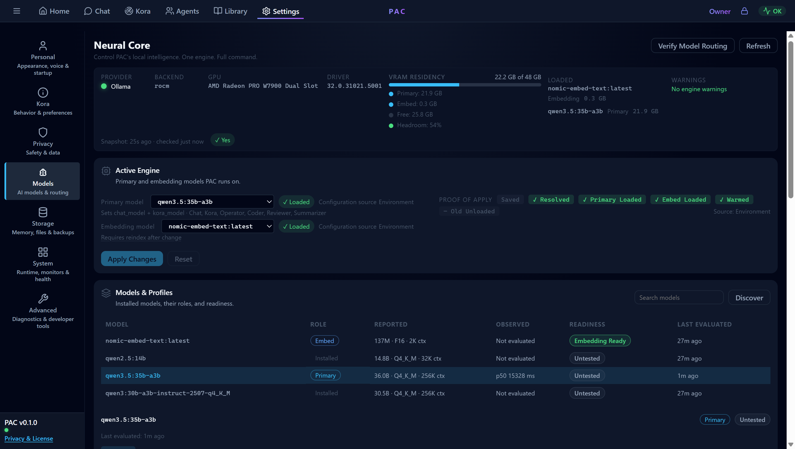
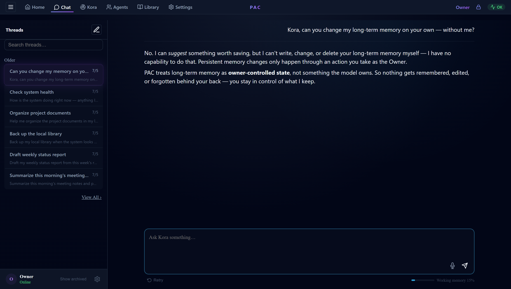
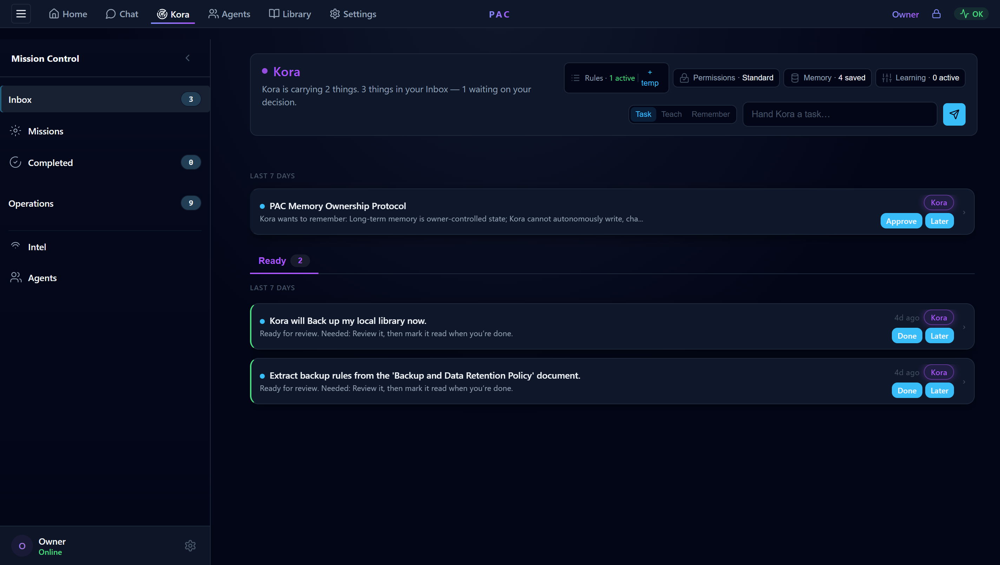

# Screenshots

These screenshots are from the current private prototype of Personal A.I. Console&trade; (PAC). They are captured with demo data on a local, owner-controlled build, and are intended to show product direction and real system behavior &mdash; not to expose private implementation, local paths, credentials, or personal data.

The single owner is shown throughout simply as **Owner**, which is also how PAC refers to the principal in the system.

For the architecture behind these views, see [architecture.md](architecture.md); for how they keep the owner in control, see [trust-model.md](trust-model.md).

---

## Plan Review and Approval

Before governed work begins, Kora prepares a plan and presents it to the Owner: the goal, the steps she intends to take, and what each step should produce. Nothing sensitive runs on the model's say-so &mdash; the Owner approves, declines, or asks for changes first. Here, a routine "back up the local library" request is paused awaiting the Owner's confirmation.

---

## Receipt-Backed Work

After approval, the work executes and leaves evidence behind. The completed plan shows each step, its outcome, and a verification that the work actually happened. As far as the system is concerned, an action without a receipt didn't happen.

---

## System Overview

The home view presents PAC as a local-first command center: current posture, overall health, local resource use, and the active local model &mdash; all running on the owner's own hardware.

---

## Model Settings

PAC treats the model as a replaceable component. The model provider is configurable through Settings; the reference build reasons with a local model via Ollama. Swap the model, and the governed system around it &mdash; authority, memory, receipts &mdash; persists.

---

## Memory Governance

Kora can suggest something worth remembering, but she cannot change long-term memory on her own. Persistent memory is treated as owner-controlled state, changed only through an action the Owner takes &mdash; so nothing is remembered, edited, or forgotten behind the owner's back. Each memory also carries its **provenance** (where it came from and how far to trust it), and the system surfaces cleanups &mdash; duplicates, conflicts, stale entries &mdash; as **reviewable proposals** rather than editing the record on its own.

---

## The Inbox: Decisions, Not Noise

The Kora station's Inbox brings the Owner only the calls that need them &mdash; each card is one clear decision, in Kora's own voice, with a colored chip naming who did the work. Attention has a real lifecycle: glancing at an item doesn't count as handling it (*seen* and *done* are tracked separately), **Later** sets an item aside and resurfaces it on schedule, and nothing is dismissed silently. The top card is the previous section's promise kept, live: Kora *asking permission to remember* &mdash; the save is a proposal awaiting the Owner's **Approve**, gated exactly like any other sensitive action.

---

*These screenshots will be supplemented with a demo walkthrough as the public showcase matures. See [README](../README.md) for current product scope.*
