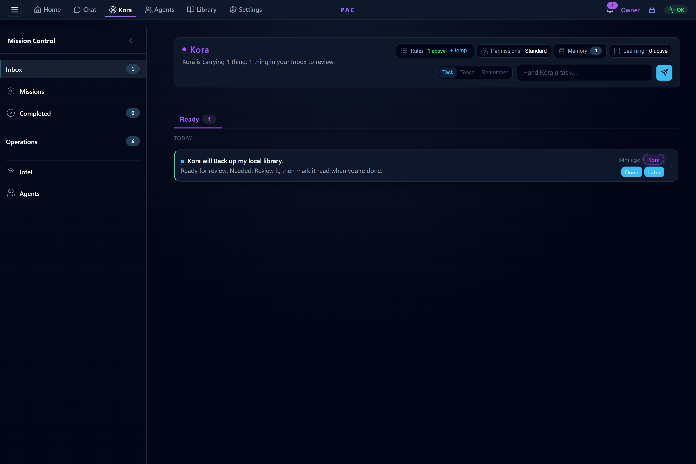
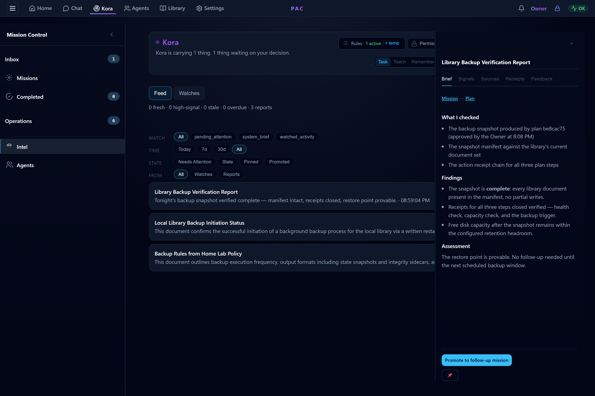

# Screenshots

These screenshots are from the current private prototype of Personal A.I. Console&trade; (PAC). They are captured with demo data on a local, owner-controlled build, and are intended to show product direction and real system behavior, not to expose private implementation, local paths, credentials, or personal data.

The single owner is shown throughout simply as **Owner**, which is also how PAC refers to the principal in the system.

For the architecture behind these views, see [architecture.md](architecture.md); for how they keep the owner in control, see [trust-model.md](trust-model.md).

---

## Plan Review and Approval

Before governed work begins, Kora prepares a plan and presents it in the inspector rail: her reasoning, the steps she intends to take, the named capability each step calls, what it should produce, and how it will be verified. Two steps here are Read-only; the backup step is marked Sensitive, and nothing sensitive runs on the model's say-so: the policy line reads *require confirmation*, so the plan pauses as *awaiting confirmation* until the Owner acts. The rail carries the full brief and the verbs that can move it, **Approve** first among them. Here, a routine "back up the local library" request is paused awaiting the Owner's word.

---

## Receipt-Backed Work

After approval, the work executes and leaves evidence behind. The same rail now shows the plan completed (**3 steps &middot; 3 done**) with the approval recorded by name and time: *Approved by you*, to the second. Each step carries its own receipt inline: start and finish timestamps, duration, the result it returned, and its raw result data one click away. Below it all, a composer invites the Owner to ask about the result or request a revision. As far as the system is concerned, an action without a receipt didn't happen.

---

## System Overview

The home view presents PAC as a local-first command center: current posture, overall health, local resource use, and the active local model, all running on the owner's own hardware.

---

## Neural Core

PAC treats the model as a replaceable component, and verifies it rather than trusting it. The Neural Core runs the local engine (Ollama in the reference build): what's loaded, where the VRAM went, and a proof-of-apply line confirming that everything actually routes to the selected model. Installed models carry readiness states, and a model that hasn't been evaluated on this machine is labeled exactly that, *untested*, until its checks run. Swap the model, and the governed system around it (authority, memory, receipts) persists, because none of it lives in the model.

---

## Memory Governance

What Kora remembers is owner-governed, in tiers: a routine observation from conversation is captured silently (every write receipted and revertible in one click), while anything sensitive, or anything contradicting what the Owner has said, is proposed and waits for approval. Personal memory can be seeded only by the Owner's own words; document, web, and tool content is refused at the write door. Each memory carries its **provenance** (where it came from and how far to trust it), and what Kora knows about the Owner is rendered on her memory card exactly as the model receives it, so nothing is remembered, edited, or forgotten off the record.

---

## The Inbox: Decisions, Not Noise

The Kora station's Inbox brings the Owner only the calls that need them: each card is one clear decision, in Kora's own voice, with a colored chip naming who did the work. Attention has a real lifecycle: glancing at an item doesn't count as handling it (*seen* and *done* are tracked separately), **Later** sets an item aside and resurfaces it on schedule, and nothing is dismissed silently. Here the completed backup has come back as a card that is *ready for review*: the work is done, but it isn't handled until the Owner says so. The strip above the queue is the governance band: Rules, Permissions, Memory, and Learning each show their live state, one click from their controls.

---

## An Agent Reports Back

Kora doesn't work alone; she operates a crew of scoped agents, each holding exactly the capabilities the Owner granted it. Here, one of those agents has verified the backup from the earlier walkthrough and filed its report into the intelligence feed: the one feed of record everything Kora watches flows through, so deliverables never scatter into side surfaces. The report opens in the right-hand inspector with its lineage one click deep: links back to the **Mission** and the **Plan** that produced it, and tabs for the signals, sources, and receipts behind the findings. It cites what was checked and what was found, and closes on the standard PAC gives its own summaries: *the restore point is provable*. The **Promote to follow-up mission** action routes through the same approval gate as any other governed work &mdash; even acting on intelligence asks first.

---

*For these screenshots tied together as one governed task, see the [demo walkthrough](../demos/demo-walkthrough.md). See [README](../README.md) for current product scope.*
